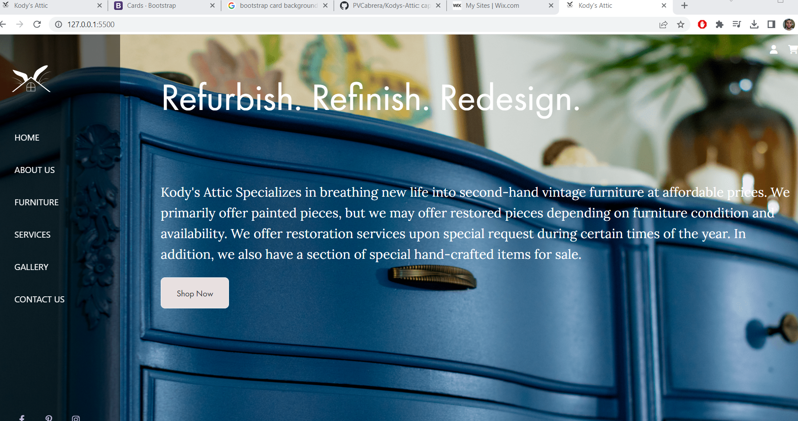
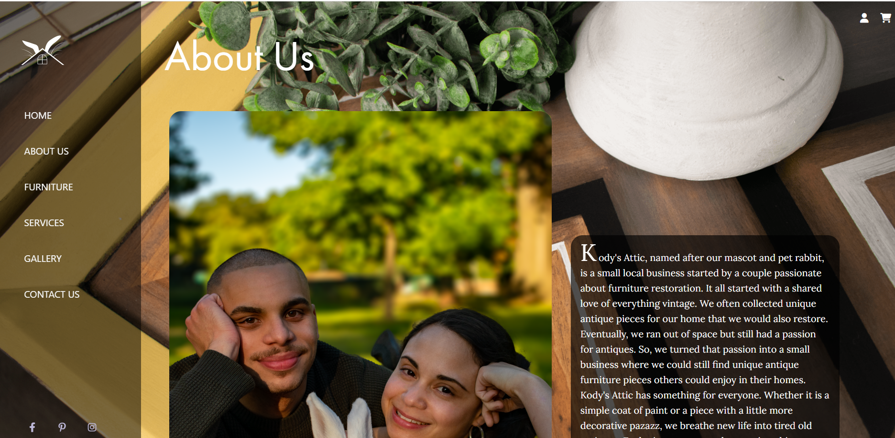
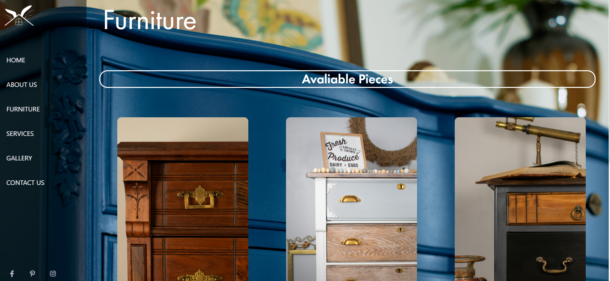
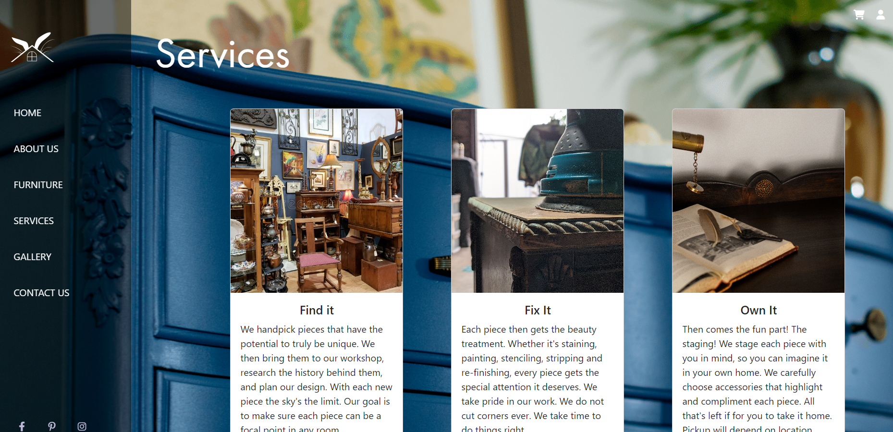
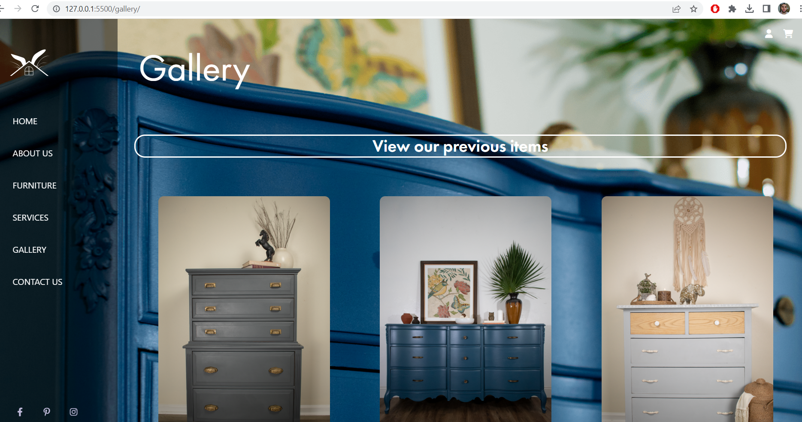
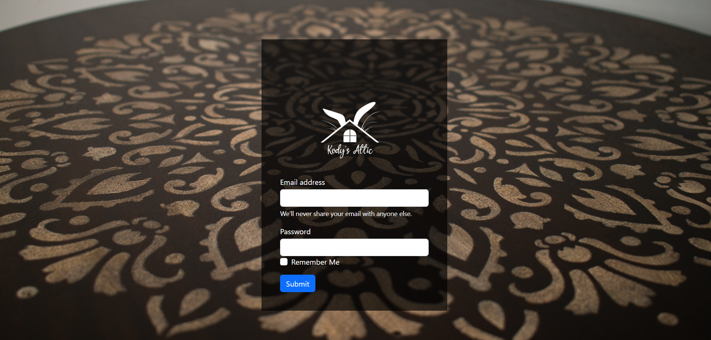
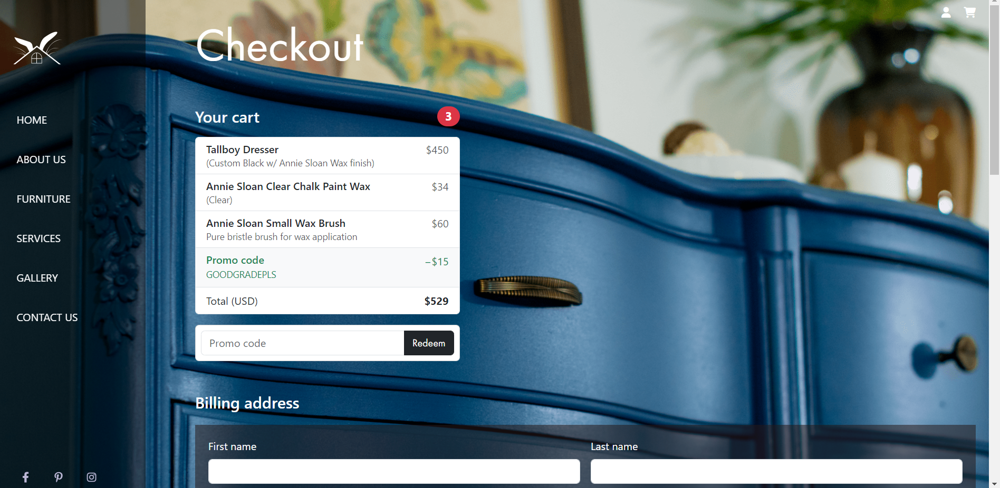

# kodys-attic
capstone-project for an ecommerce site
## Hello all this is my first website made for the capstone project, the site is about a furniture business that me and my girlfriend started in 2019. The site contains about 8 pages, two of which are not included in the main nav section.

### My site consist of a home page, an about me section, a check out page, furniture section which shows what pieces are for sale. A gallery section, a login page, a services page, and the user registration page.

###

#### Below are some screenshots of the site. 

